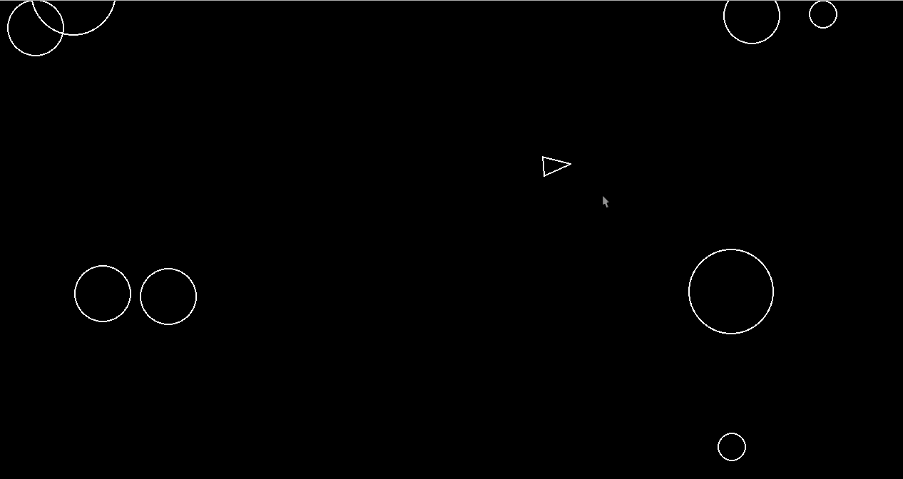

# 🚀 Asteroids

An arcade classic, **Asteroids**, built using Python and Pygame. Fly, rotate, and shoot your way through a field of ever-spawning space rocks—watch out for collisions or it's game over! 💥

---
## 🎮 Features

- 🌀 Smooth spaceship movement and rotation
- 🔫 Shooting mechanic with cooldown
- 🪨 Dynamic asteroid field with edge spawning
- ✂️ Asteroid splitting after impact
- ☠️ Collision detection between ship, bullets, and asteroids
- 🧠 Organized with custom sprite groups for clean updating/drawing
---
## 📸 Gameplay Preview



---
## 🧑‍💻 Code Structure
```markdown
├── main.py                  # Entry point
├── constants.py            # Global game settings
├── model/
│   ├── asteroid.py         # Asteroid class (movement, splitting)
│   ├── asteroidfield.py    # Handles spawning logic
│   ├── circleshape.py      # Base class for circular game objects
│   ├── player.py           # The spaceship class
│   ├── shot.py             # Bullets
```
---
## 🕹️ Controls

| Key | Action | 
|-------|-------|
| A / ← | Rotate left | 
| D / → | Rotate right | 
| W / ↑ | Move forward | 
| S / ↓ | Move backward | 
| Space | Shoot a laser bullet | 
| ESC | Exit game |
---
## Requirements

- Python installed (I used Python 3.11, but it works on almost every python version)

---
## 🔧 Installation & Run
1. Clone the repo:
    ```shell
    git clone https://github.com/bfjeje/bootdev_asteroids_game.git
    cd bootdev_asteroids_game
    ```

2. Create and activate a virtual environment (optional but recommended):
    ```shell
    python -m venv .venv
    source .venv/bin/activate   # For Linux/macOS
    .venv\Scripts\activate      # For Windows
    ```

3. Install dependencies:
    ```shell
    pip install pygame
    ```

4. Run the game:
    ```shell
    python main.py
    ```
---
## 🗿 Todo & Ideas
- 💣 Add **explosions** when asteroids split
- 🧬 **Particle** effects for bullets
- 🚀 **Thruster** animation for movement
- 📈 **Score** and **lives** system
- 🕹️ **Game menu** and **pause** functionality
- ⚔️ **Local multiplayer** chaos

---
## 🤝 Contributing
**Contributions welcome!** If you spot a bug, have a feature idea, or want to make the game more stylish, open a **PR or issue** ✨

---
## 📜 License
**MIT License** — do anything with it, just don't forget to give credit!

---
Made with Pygame and space love by Bruno 👨‍🚀
